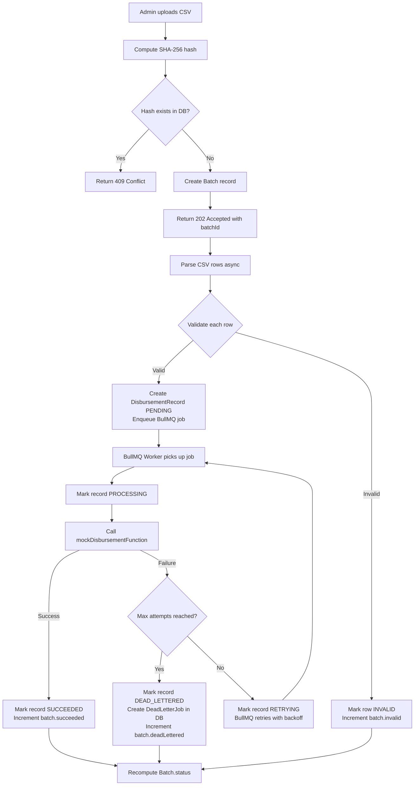

# Payroll Processing Flow

```mermaid
flowchart TD
    A[Admin uploads CSV] --> B[Compute SHA-256 hash]
    B --> C{Hash exists in DB?}
    C -- Yes --> D[Return 409 Conflict]
    C -- No --> E[Create Batch record]
    E --> F[Return 202 Accepted with batchId]
    F --> G[Parse CSV rows async]
    G --> H{Validate each row}
    H -- Invalid --> I[Mark row INVALID\nIncrement batch.invalid]
    H -- Valid --> J[Create DisbursementRecord PENDING\nEnqueue BullMQ job]
    J --> K[BullMQ Worker picks up job]
    K --> L[Mark record PROCESSING]
    L --> M[Call mockDisbursementFunction]
    M -- Success --> N[Mark record SUCCEEDED\nIncrement batch.succeeded]
    M -- Failure --> O{Max attempts reached?}
    O -- No --> P[Mark record RETRYING\nBullMQ retries with backoff]
    P --> K
    O -- Yes --> Q[Mark record DEAD_LETTERED\nCreate DeadLetterJob in DB\nIncrement batch.deadLettered]
    N --> R[Recompute Batch.status]
    Q --> R
    I --> R
```
